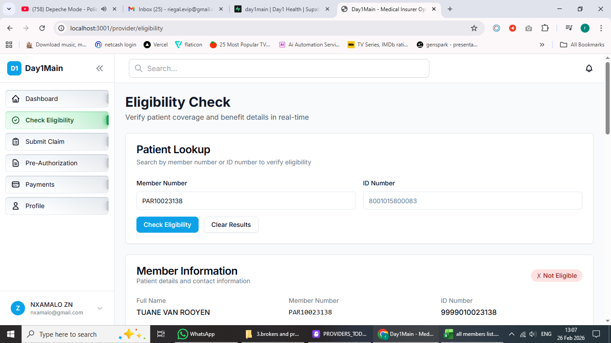

# Providers System - Implementation Checklist

## Phase 1: Provider Setup & Administration

### 1.1 Provider Database Schema
- [x] Define providers table structure (practice_number, specialties, SLA terms, contract details)
- [ ] Create provider_contracts table (SLA terms, rates, effective dates)
- [ ] Create provider_specialties table (link providers to specialties)
- [ ] Create provider_network table (in-network vs out-of-network status)
- [x] Add indexes for performance
- [ ] Set up RLS policies

### 1.2 Provider Admin UI (/admin/providers)
- [x] Connect to real Supabase data (showing all 1,916 providers)
- [x] Add provider registration form (collapsible form on main page)
- [ ] Add provider approval workflow
- [ ] Add provider contract management
- [ ] Add provider SLA tracking
- [ ] Add provider performance metrics
- [ ] Add bulk import functionality

### 1.3 Provider Data Import
- [x] Create import script for providers
- [x] Import providers with practice numbers (1,916 providers imported)
- [x] Import specialties (GP, Dentist)
- [ ] Import SLA terms and rates
- [x] Link providers to network status
- [x] Validate imported data

### 1.4 Provider Authentication
- [ ] Create provider user accounts
- [ ] Link providers to users table
- [ ] Set up provider role permissions
- [ ] Create provider login flow
- [ ] Add provider profile management
- [ ] Add password reset for providers

### 1.5 Provider Network Management
- [ ] Define in-network vs out-of-network rules
- [ ] Link providers to benefit plans
- [ ] Set reimbursement rates by network status
- [ ] Add network provider search
- [ ] Add provider directory for members

---

## Phase 2: Eligibility & Pre-Authorization

### 2.1 Eligibility Check System
- [ ] Create API route for eligibility verification
- [ ] Verify member active status
- [ ] Check member benefits and limits
- [ ] Check waiting periods
- [ ] Check annual/lifetime limits used
- [ ] Return coverage details by service type
- [ ] Add real-time eligibility check to provider portal

### 2.2 Pre-Authorization Workflow
- [ ] Create pre_authorizations table
- [ ] Create API routes for pre-auth submission
- [ ] Add pre-auth request form (provider portal)
- [ ] Add pre-auth review interface (admin)
- [ ] Add pre-auth approval/denial workflow
- [ ] Add pre-auth status tracking
- [ ] Send notifications on pre-auth decisions

### 2.3 Service Code Validation
- [ ] Create service_codes table (procedure codes, ICD-10)
- [ ] Link service codes to benefits
- [ ] Validate service codes against member plan
- [ ] Check if pre-auth required for service
- [ ] Calculate estimated coverage

---

## Phase 3: Claims Submission

### 3.1 Claims Database Schema
- [ ] Define claims table structure
- [ ] Create claim_line_items table (multiple services per claim)
- [ ] Create claim_documents table (attachments)
- [ ] Create claim_status_history table (audit trail)
- [ ] Add indexes and RLS policies

### 3.2 Claims Submission (Provider Portal)
- [ ] Create claims submission API route
- [ ] Build claims submission form
- [ ] Add member lookup/verification
- [ ] Add service code selection
- [ ] Add diagnosis code (ICD-10) input
- [ ] Add document upload (invoices, medical reports)
- [ ] Validate claim before submission
- [ ] Generate claim number

### 3.3 Claims Validation
- [ ] Verify member was active on service date
- [ ] Verify service is covered under plan
- [ ] Check benefit limits
- [ ] Check exclusions
- [ ] Check waiting periods
- [ ] Flag high-value claims for review
- [ ] Auto-approve simple claims within rules

---

## Phase 4: Claims Adjudication

### 4.1 Claims Review Interface (Admin)
- [ ] Connect claims workbench to real data
- [ ] Add claims queue with filters
- [ ] Add claim detail view
- [ ] Add member history view
- [ ] Add benefit verification panel
- [ ] Add claims assessor notes
- [ ] Add claims assignment to assessors

### 4.2 Claims Adjudication Workflow
- [ ] Create API routes for claim actions
- [ ] Implement approve claim logic
- [ ] Implement reject claim logic
- [ ] Implement pend claim logic (request more info)
- [ ] Calculate payable amount (apply co-pays, limits)
- [ ] Apply benefit rules and exclusions
- [ ] Generate explanation of benefits (EOB)
- [ ] Send notifications to provider

### 4.3 Claims Business Rules Engine
- [ ] Define auto-adjudication rules
- [ ] Implement benefit limit checks
- [ ] Implement exclusion checks
- [ ] Implement co-payment calculations
- [ ] Implement out-of-network reductions
- [ ] Flag fraud indicators
- [ ] Escalate complex claims

---

## Phase 5: Claims Payment

### 5.1 Payment Processing
- [ ] Create payment_batches table
- [ ] Create provider_payments table
- [ ] Generate payment batches for approved claims
- [ ] Calculate provider payment amounts
- [ ] Apply provider rates/SLA terms
- [ ] Generate payment files
- [ ] Track payment status

### 5.2 Provider Payment Portal
- [ ] Add payment history view
- [ ] Add payment reconciliation
- [ ] Add payment statements
- [ ] Add outstanding claims view
- [ ] Add payment dispute submission

### 5.3 Payment Reconciliation
- [ ] Match payments to claims
- [ ] Track payment confirmations
- [ ] Handle payment disputes
- [ ] Generate payment reports
- [ ] Integrate with accounting system

---

## Phase 6: Reporting & Analytics

### 6.1 Provider Reports
- [ ] Claims submitted by provider
- [ ] Approval/rejection rates
- [ ] Average processing time
- [ ] Payment turnaround time
- [ ] Top services by provider

### 6.2 Claims Reports
- [ ] Claims by status
- [ ] Claims by service type
- [ ] High-value claims
- [ ] Rejected claims analysis
- [ ] Fraud indicators report

### 6.3 Financial Reports
- [ ] Claims paid vs submitted
- [ ] Outstanding liabilities
- [ ] Provider payment summary
- [ ] Cost per member per month (PMPM)
- [ ] Loss ratio analysis

---

## Phase 7: Integration & Optimization

### 7.1 System Integration
- [ ] Integrate with member portal (view claims)
- [ ] Integrate with broker portal (claims visibility)
- [ ] Integrate with finance system
- [ ] Integrate with document management
- [ ] Set up automated notifications

### 7.2 Performance Optimization
- [ ] Add caching for eligibility checks
- [ ] Optimize claims queries
- [ ] Add background jobs for processing
- [ ] Set up monitoring and alerts
- [ ] Add audit logging

### 7.3 Compliance & Security
- [ ] POPIA compliance for claims data
- [ ] Secure document storage
- [ ] Audit trail for all claim actions
- [ ] Data retention policies
- [ ] Access control and permissions

---

## Current Status: Phase 1 - Provider Setup & Administration

### ✅ COMPLETED:
- Provider database schema with all columns (provider_number, name, profession, phone, fax, address, suburb, region, province, etc.)
- Imported 1,916 providers from Excel with all data
- All providers marked as "active" status
- Provider Admin UI displaying all 1,916 providers with full information
- Horizontal scrollbar at top of table for easy navigation
- Provider registration form (add new providers manually by admin)
- API route for fetching and creating providers
- Search and filter functionality
- Provider detail page with view/edit/delete functionality
- Provider login credentials system (stored in providers table)
- Provider authentication and sidebar navigation
- Provider dashboard with stats and quick actions
- **Eligibility Check API** - Verifies member status, policy, and coverage
- **Eligibility Check UI** - Provider can search by member number or ID number

### 🔄 IN PROGRESS:
- Eligibility system showing real member data (benefits and limits are mock data)

### 📝 NEXT TASKS (Phase 2 completion):
1. **Link members to policies** - Ensure all members have policy_id set
2. **Create benefits table** - Store actual benefit limits per plan
3. **Track benefit usage** - Calculate used amounts from claims
4. **Waiting periods logic** - Calculate based on policy start date
5. **Pre-authorization system** - Allow providers to request pre-auth for procedures

### 📝 WORKFLOW CLARIFICATION:
- **Admin adds provider manually** → Status = "active" (no approval needed)
- **Provider self-registers online** → Status = "pending" → Admin reviews → Approve/Reject
- **Suspended providers** → Admin can suspend for violations
- **Inactive providers** → Providers who left the network

### 📋 AFTER PHASE 1:
Move to **Phase 2: Eligibility & Pre-Authorization** to enable providers to check member eligibility before treatment.
